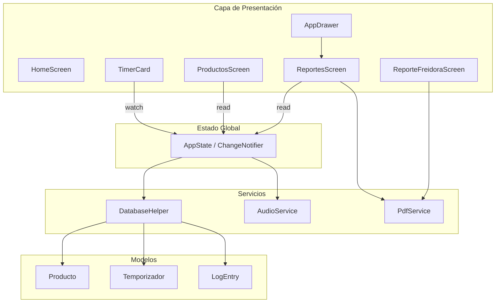
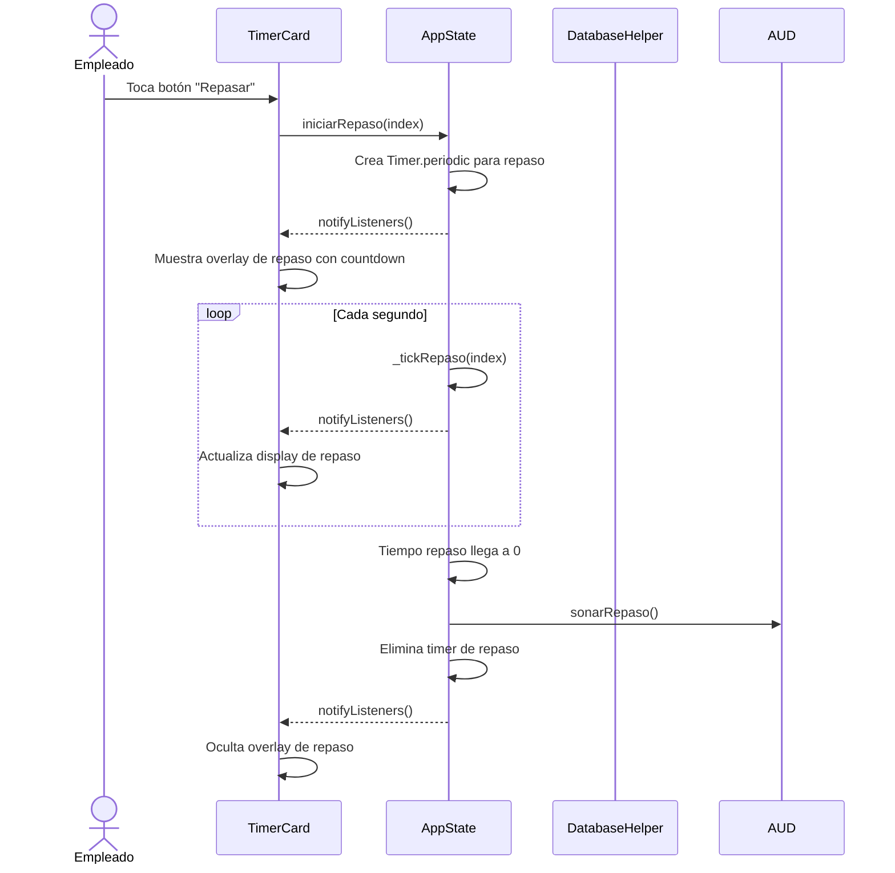
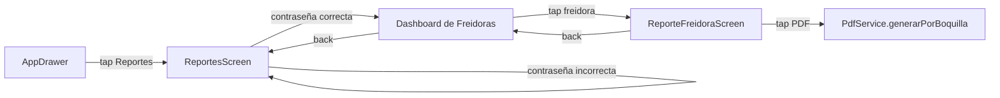
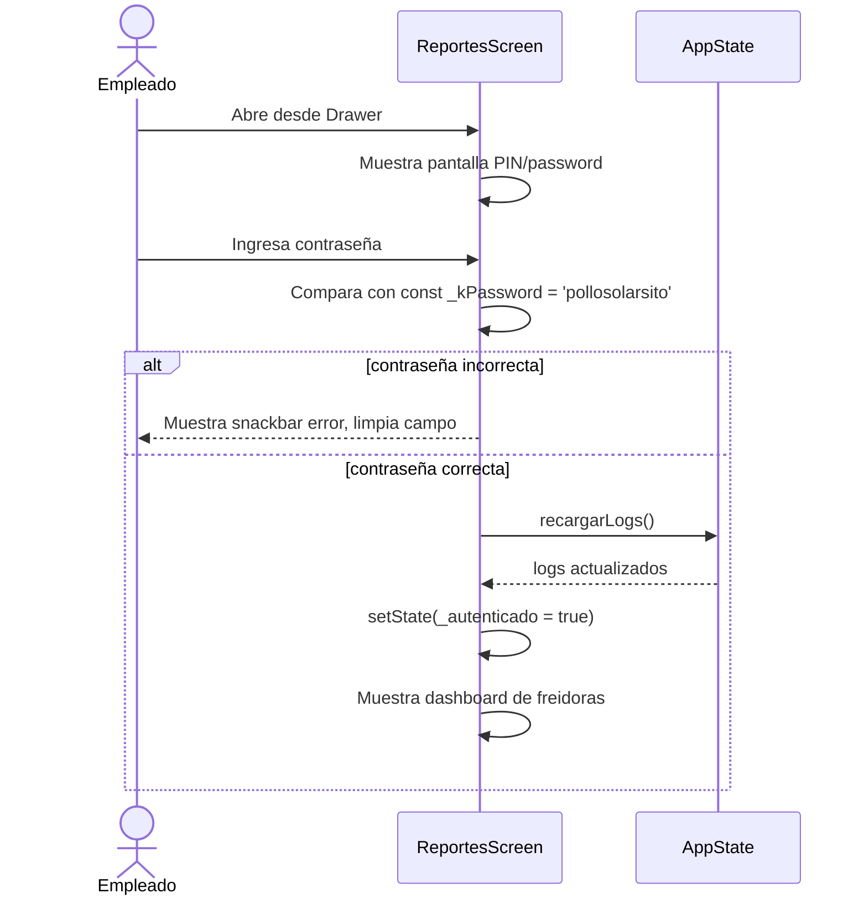

# Documento de Diseño: Temporizador 2.0

## Resumen

Este documento cubre el diseño técnico completo (High-Level + Low-Level) de la versión 2.0 de la app de control de freidoras El Solar. Los dos módulos nuevos son:

1. **Módulo 1 – Tiempo de Repaso**: agrega un countdown independiente por freidora, con su propia boquilla configurada, sin interrumpir el ciclo cocción/tostado.
2. **Módulo 2 – Reportes con Autenticación**: nueva sección del drawer, protegida por contraseña, con dashboard de estadísticas por freidora/boquilla y exportación PDF.

---

## Arquitectura General





---

## Módulo 1: Tiempo de Repaso

### Visión General

El repaso es un countdown **paralelo e independiente** al ciclo principal cocción → esperando_tostado → tostado. Se activa manualmente desde la `TimerCard` mediante un botón siempre visible. El usuario puede lanzar un repaso mientras la freidora está en cocción, en tostado, o incluso detenida. El repaso no pausa ni modifica el estado principal del temporizador.

### Flujo de Interacción




### Cambios al Modelo `Producto`

**Archivo**: `lib/models/producto.dart`

Campos nuevos:

```dart
/// Tiempo de repaso en MINUTOS (0 = sin repaso). Se guarda en segundos en BD.
final int tiempoRepaso;

/// Boquilla donde aplica el repaso: 1 = cocción, 2 = tostado.
/// Valor por defecto: 1.
final int boquillaRepaso;
```

Cambios en `toMap()`:
```dart
'tiempo_repaso': tiempoRepaso * 60,       // minutos → segundos
'id_boquilla_repaso': boquillaRepaso,
```

Cambios en `fromMap()`:
```dart
tiempoRepaso: ((m['tiempo_repaso'] as int? ?? 0) ~/ 60),
boquillaRepaso: m['id_boquilla_repaso'] as int? ?? 1,
```

Cambios en `getProductos()` de `DatabaseHelper`: añadir las columnas `tiempo_repaso` e `id_boquilla_repaso` a la lista de columnas explícitas. También en `updateProducto()` incluir ambos campos en el Map que se pasa a `db.update()`.


### Migración BD — Versión 5

**Archivo**: `lib/services/database_helper.dart`

```dart
// En _initDb():
version: 5,   // era 4

// En _onUpgrade():
if (oldVersion < 5) {
  await db.execute(
    'ALTER TABLE producto ADD COLUMN tiempo_repaso INTEGER NOT NULL DEFAULT 0');
  await db.execute(
    'ALTER TABLE producto ADD COLUMN id_boquilla_repaso INTEGER NOT NULL DEFAULT 1');
}
```

En `_onCreate()` agregar las columnas directamente al `CREATE TABLE producto`:
```sql
tiempo_repaso      INTEGER NOT NULL DEFAULT 0,
id_boquilla_repaso INTEGER NOT NULL DEFAULT 1
```

### Estado del Repaso en `AppState`

El repaso vive **solo en memoria** (no se persiste en BD). Si la app se cierra mientras corre un repaso, al reabrir simplemente no estará activo — es el comportamiento esperado dado que es un recordatorio efímero.

**Nuevas estructuras internas en `AppState`**:

```dart
// Mapa: índice del temporizador → segundos restantes de repaso (0 = sin repaso activo)
final Map<int, int> _repasoRestante = {};

// Mapa: índice del temporizador → Timer.periodic del repaso
final Map<int, Timer> _repasoTimers = {};
```


**Métodos nuevos en `AppState`**:

```dart
/// Inicia el countdown de repaso para el temporizador en [index].
/// Si ya hay un repaso activo para ese índice, se cancela y se reinicia.
/// Precondición: temporizador[index] existe y producto.tiempoRepaso > 0.
/// Postcondición: _repasoRestante[index] == producto.tiempoRepaso * 60,
///                _repasoTimers[index] está activo.
void iniciarRepaso(int index);

/// Tick interno del repaso — descuenta 1 segundo.
/// Cuando llega a 0: cancela el timer, elimina la entrada del mapa,
/// llama AudioService.sonarRepaso() y notifyListeners().
void _tickRepaso(int index);

/// Cancela el repaso activo para [index] sin notificar (uso interno en dispose).
void _cancelarRepaso(int index);

/// Expone si hay un repaso activo para [index] (para la TimerCard).
bool tieneRepasoActivo(int index) => (_repasoRestante[index] ?? 0) > 0;

/// Segundos restantes del repaso para [index] (0 si no hay repaso).
int segundosRepaso(int index) => _repasoRestante[index] ?? 0;
```

En `dispose()` agregar:
```dart
for (final t in _repasoTimers.values) t.cancel();
_repasoTimers.clear();
_repasoRestante.clear();
```

En `eliminarTemporizador()` agregar al inicio:
```dart
_cancelarRepaso(index);
```


### Cambios a `TimerCard`

**Archivo**: `lib/widgets/timer_card.dart`

#### Botón "Repasar" en el Header

El botón se agrega a `_Header` como icono en la esquina superior izquierda. Es visible **siempre** (no depende del estado del temporizador), pero se deshabilita si `producto.tiempoRepaso == 0`.

Cambio en el `Row` del `_Header`:

```dart
Row(
  crossAxisAlignment: CrossAxisAlignment.start,
  children: [
    // NUEVO: botón Repasar a la izquierda
    _BotonRepaso(
      index: widget.index,
      tiempoRepaso: t.producto.tiempoRepaso,
    ),
    const SizedBox(width: 4),
    // ... (el Column con nombre y freidora, sin cambios)
    Expanded(child: Column(...)),
    // botón pausa (sin cambios)
    if (corriendo) GestureDetector(...),
  ],
)
```

#### Widget `_BotonRepaso`

```dart
class _BotonRepaso extends StatelessWidget {
  final int index;
  final int tiempoRepaso; // minutos — 0 = sin repaso configurado

  // Toca el botón → llama AppState.iniciarRepaso(index)
  // Si tiempoRepaso == 0, el botón aparece atenuado y no responde
}
```


#### Overlay de Repaso en la Card

Cuando `AppState.tieneRepasoActivo(index)` es `true`, la `TimerCard` superpone una pequeña banda informativa sobre el área central. Se usa `Consumer<AppState>` limitado o `Selector` para que solo ese widget se reconstruya en cada tick del repaso (no toda la card).

```dart
// En el build() de _TimerCardState, dentro del Column principal,
// antes del Expanded del círculo de progreso:

Selector<AppState, int>(
  selector: (_, state) => state.segundosRepaso(widget.index),
  builder: (ctx, segundos, _) {
    if (segundos <= 0) return const SizedBox.shrink();
    final boquilla = widget.temporizador.producto.boquillaRepaso;
    return _BandaRepaso(
      segundosRestantes: segundos,
      boquilla: boquilla,
    );
  },
),
```

**Widget `_BandaRepaso`**: muestra "REPASO B1" o "REPASO B2" con el tiempo restante en formato `MM:SS`. Color de acento: amarillo-ámbar `Color(0xFFF9A825)` para diferenciarlo del rojo (cocción) y naranja (tostado).

### Formulario de Producto — Campos Nuevos

**Archivo**: `lib/screens/productos_screen.dart`

En `_FormProductoState` agregar:

```dart
late final TextEditingController _repasoCtrl;
int _boquillaRepaso = 1; // estado local del selector

// initState: inicializar con producto?.tiempoRepaso ?? ''
// dispose: dispose del controller
```

En el `build()`, después de la fila de Cocción/Tostado:

```dart
const SizedBox(height: 16),
_labelF('REPASO (MIN) — OPCIONAL'),
const SizedBox(height: 8),
Row(
  children: [
    Expanded(child: _campoTiempo(_repasoCtrl, 'Ej. 2')),
    const SizedBox(width: 12),
    // Selector de boquilla: dos botones tipo ToggleButtons o SegmentedButton
    _SelectorBoquilla(
      valor: _boquillaRepaso,
      onChanged: (v) => setState(() => _boquillaRepaso = v),
    ),
  ],
),
```

En `_submit()`, construir `Producto` con los nuevos campos:
```dart
Producto(
  // ... campos existentes ...
  tiempoRepaso: int.tryParse(_repasoCtrl.text) ?? 0,
  boquillaRepaso: _boquillaRepaso,
)
```

**Widget `_SelectorBoquilla`**: dos chips/botones con etiquetas "B1" y "B2". El seleccionado se muestra con `Color(0xFFC62828)` y fondo `Color(0xFFFCEAEA)`.


---

## Módulo 2: Reportes con Autenticación

### Visión General

La sección "Reportes" reemplaza a "Historial" en el `AppDrawer`. Incluye una pantalla de login simple (contraseña fija en código, ya que no es requerimiento de seguridad alta), un dashboard con listado de freidoras, y una pantalla de detalle por freidora con historial separado por boquilla, filtros de fecha y exportación PDF.

### Flujo de Navegación



### Diagrama de Secuencia — Autenticación y Acceso




### Cambio al Modelo `LogEntry`

**Archivo**: `lib/models/log_entry.dart`

Agregar campo `boquilla` para distinguir si el log corresponde a cocción (boquilla 1) o tostado (boquilla 2):

```dart
/// Boquilla que generó este log: 1 = cocción, 2 = tostado.
/// Valor por defecto: 1 (compatibilidad con logs anteriores).
final int boquilla;
```

En `toMap()`:
```dart
'boquilla': boquilla,
```

En `fromMap()`:
```dart
boquilla: m['boquilla'] as int? ?? 1,
```

**Migración BD — también en versión 5**:
```dart
// En _onUpgrade, oldVersion < 5:
await db.execute(
  "ALTER TABLE log ADD COLUMN boquilla INTEGER NOT NULL DEFAULT 1");

// En _onCreate, tabla log:
boquilla INTEGER NOT NULL DEFAULT 1,
```

**Impacto en `AppState._finalizarTemporizador`**: al cerrar el log actualmente se crea un único registro. Con la nueva estructura, el ciclo genera **dos entradas** de log — una por cocción (boquilla 1) y una por tostado (boquilla 2). Se revisa la lógica de apertura/cierre de logs:

- Al iniciar cocción (`toggleTemporizador`, estado inicial): `insertLog` con `boquilla: 1`
- Al transicionar a `esperando_tostado`: cerrar el log de cocción con `cerrarLog(logId)`
- Al iniciar tostado (`toggleTemporizador`, estado `esperando_tostado`): `insertLog` nuevo con `boquilla: 2`
- Al finalizar tostado: cerrar el log de tostado con `cerrarLog(logId)`

Este cambio requiere revisar `_logIds` en `AppState` — actualmente solo guarda un ID por índice. Con el nuevo diseño, al pasar a `esperando_tostado` se limpia `_logIds[index]` (cocción ya cerrada), y al abrir el log de tostado se vuelve a asignar.


### Queries Nuevas en `DatabaseHelper`

```dart
/// Logs de una freidora específica, filtrados opcionalmente por boquilla y rango de fechas.
/// [nombreFreidora] es el código fotográfico guardado en el log.
/// [boquilla] null = ambas boquillas, 1 = cocción, 2 = tostado.
Future<List<LogEntry>> getLogsPorFreidora({
  required String nombreFreidora,
  int? boquilla,
  String? desde,   // YYYY-MM-DD o null = sin límite inferior
  String? hasta,   // YYYY-MM-DD o null = sin límite superior
}) async;

/// Estadísticas agregadas para la pantalla de reporte.
/// Devuelve: total_coccion, total_tostado, promedio_duracion_segundos.
Future<Map<String, dynamic>> getEstadisticasFreidora({
  required String nombreFreidora,
  String? desde,
  String? hasta,
}) async;
```

Implementación de `getEstadisticasFreidora` usa una query SQL con `COUNT` y `AVG`:
```sql
SELECT
  SUM(CASE WHEN boquilla = 1 THEN 1 ELSE 0 END) AS total_coccion,
  SUM(CASE WHEN boquilla = 2 THEN 1 ELSE 0 END) AS total_tostado,
  AVG(
    CAST(
      (julianday(fecha_hora_fin) - julianday(fecha_hora_inicio)) * 86400
    AS INTEGER)
  ) AS promedio_seg
FROM log
WHERE nombre_freidora = ?
  AND tipo = 'coccion'
  AND fecha_hora_fin IS NOT NULL
  -- filtros opcionales de fecha aplicados dinámicamente
```

Índice adicional para mejorar la query por freidora:
```sql
CREATE INDEX idx_log_freidora ON log(nombre_freidora);
```
Este índice se crea en `_onCreate` y también en `_onUpgrade` cuando `oldVersion < 5`.


### Pantalla `ReportesScreen`

**Archivo nuevo**: `lib/screens/reportes_screen.dart`

Esta pantalla maneja dos estados con `StatefulWidget`:
- `_autenticado = false` → muestra el formulario de contraseña
- `_autenticado = true` → muestra el dashboard de freidoras

#### Estado de autenticación

```dart
class _ReportesScreenState extends State<ReportesScreen> {
  bool _autenticado = false;
  final _pwdCtrl = TextEditingController();
  bool _errorPwd = false;
  bool _ocultarPwd = true;

  static const String _kPassword = 'pollosolarsito';

  void _validarPassword() {
    if (_pwdCtrl.text.trim() == _kPassword) {
      context.read<AppState>().recargarLogs();
      setState(() { _autenticado = true; _errorPwd = false; });
    } else {
      setState(() { _errorPwd = true; });
      _pwdCtrl.clear();
    }
  }
}
```

#### Vista de login

Pantalla centrada con:
- Icono `Icons.bar_chart` grande en rojo
- Título "Reportes"
- `TextField` con `obscureText: _ocultarPwd` y toggle de visibilidad
- Mensaje de error en rojo si `_errorPwd`
- Botón "ACCEDER" que llama `_validarPassword()`

#### Dashboard de freidoras

Una vez autenticado, muestra `ListView` de las freidoras del `AppState`. Cada freidora es una `Card` con su código y descripción, con `onTap` que navega a `ReporteFreidoraScreen`.

```dart
// Estructura del dashboard:
Column(
  children: [
    // Header con título "Reportes" y botón de cerrar sesión (vuelve al login)
    _HeaderReportes(onCerrarSesion: () => setState(() => _autenticado = false)),
    // Lista de freidoras
    Expanded(
      child: ListView.builder(
        itemCount: freidoras.length,
        itemBuilder: (ctx, i) => _TarjetaFreidoraReporte(freidora: freidoras[i]),
      ),
    ),
  ],
)
```


### Pantalla `ReporteFreidoraScreen`

**Archivo nuevo**: `lib/screens/reporte_freidora_screen.dart`

Recibe la `Freidora` como parámetro de construcción. Carga los logs al montarse usando `DatabaseHelper` directamente (no necesita pasar por `AppState` dado que son datos de solo lectura para esta pantalla).

#### Parámetros de construcción

```dart
class ReporteFreidoraScreen extends StatefulWidget {
  final Freidora freidora;
  const ReporteFreidoraScreen({super.key, required this.freidora});
}
```

#### Estado interno

```dart
class _ReporteFreidoraScreenState extends State<ReporteFreidoraScreen> {
  // Filtro activo: 'hoy' | 'rango' | 'todo'
  String _filtro = 'hoy';
  DateTimeRange? _rango;

  // Datos cargados
  List<LogEntry> _logsBoquilla1 = [];
  List<LogEntry> _logsBoquilla2 = [];
  Map<String, dynamic> _stats = {};
  bool _cargando = true;

  // Pestañas: Estadísticas | Boquilla 1 | Boquilla 2
}
```

#### Carga de datos

```dart
Future<void> _cargarDatos() async {
  setState(() => _cargando = true);
  final db = DatabaseHelper.instance;
  final String? desde = _calcularDesde();   // null si filtro='todo'
  final String? hasta = _calcularHasta();

  final b1 = await db.getLogsPorFreidora(
    nombreFreidora: widget.freidora.codigo,
    boquilla: 1,
    desde: desde,
    hasta: hasta,
  );
  final b2 = await db.getLogsPorFreidora(
    nombreFreidora: widget.freidora.codigo,
    boquilla: 2,
    desde: desde,
    hasta: hasta,
  );
  final stats = await db.getEstadisticasFreidora(
    nombreFreidora: widget.freidora.codigo,
    desde: desde,
    hasta: hasta,
  );

  setState(() {
    _logsBoquilla1 = b1;
    _logsBoquilla2 = b2;
    _stats = stats;
    _cargando = false;
  });
}
```


#### Layout de la pantalla

```dart
Scaffold(
  appBar: AppBar(
    title: Text(widget.freidora.codigo),
    // botón PDF en las acciones
    actions: [
      IconButton(
        icon: Icon(Icons.picture_as_pdf_outlined),
        onPressed: _exportarPDF,
      ),
    ],
  ),
  body: Column(
    children: [
      // Selector de filtro (Hoy / Rango de fechas / Todo)
      _SelectorFiltro(
        filtroActual: _filtro,
        onFiltroChanged: (f) { _filtro = f; _cargarDatos(); },
        onRangoChanged: (r) { _rango = r; _filtro = 'rango'; _cargarDatos(); },
      ),
      // Tarjeta de estadísticas
      if (!_cargando) _TarjetaEstadisticas(stats: _stats),
      // TabBar: Boquilla 1 | Boquilla 2
      Expanded(
        child: _cargando
          ? Center(child: CircularProgressIndicator())
          : DefaultTabController(
              length: 2,
              child: Column(
                children: [
                  TabBar(
                    tabs: [
                      Tab(text: 'Boquilla 1 — Cocción'),
                      Tab(text: 'Boquilla 2 — Tostado'),
                    ],
                  ),
                  Expanded(
                    child: TabBarView(
                      children: [
                        _ListaLogs(logs: _logsBoquilla1),
                        _ListaLogs(logs: _logsBoquilla2),
                      ],
                    ),
                  ),
                ],
              ),
            ),
      ),
    ],
  ),
)
```

#### Widget `_TarjetaEstadisticas`

Muestra tres métricas en una fila:
- **Total cocción** (logs boquilla 1 con `fechaHoraFin != null`)
- **Total tostado** (logs boquilla 2 con `fechaHoraFin != null`)
- **Tiempo promedio** (en formato `Xm Ys`, del campo `promedio_seg` de la query)


### Exportación PDF Extendida

**Archivo**: `lib/services/pdf_service.dart`

Agregar método específico para reportes por freidora:

```dart
/// Genera PDF de reporte de una freidora con secciones por boquilla.
/// [nombreFreidora]: código de la freidora (ej. "F-01")
/// [logsBoquilla1]: lista de logs de cocción
/// [logsBoquilla2]: lista de logs de tostado
/// [estadisticas]: Map con total_coccion, total_tostado, promedio_seg
/// [etiquetaPeriodo]: texto descriptivo del filtro aplicado (ej. "Hoy", "01/06/2025 – 07/06/2025")
static Future<void> generarReporteFreidora({
  required String nombreFreidora,
  required List<LogEntry> logsBoquilla1,
  required List<LogEntry> logsBoquilla2,
  required Map<String, dynamic> estadisticas,
  String etiquetaPeriodo = '',
}) async;
```

Estructura del PDF:
1. **Header**: "EL SOLAR — Reporte Freidora [codigo]" con fecha de generación
2. **Sección estadísticas**: tres recuadros con métricas agregadas
3. **Sección Boquilla 1 — Cocción**: tabla con columnas Empleado / Producto / Inicio / Fin / Duración
4. **Sección Boquilla 2 — Tostado**: misma estructura
5. **Footer**: paginación + "SUCURSAL CAÑOTO"

El método `generarYCompartir` existente se mantiene sin cambios para compatibilidad con `LogsScreen`.

### Cambio al `AppDrawer`

**Archivo**: `lib/widgets/app_drawer.dart`

Reemplazar el ítem "Historial" por "Reportes":

```dart
// Antes:
_DrawerItem(
  icono: Icons.history,
  texto: 'Historial',
  activo: pantallaActual == 'logs',
  badge: 'PDF',
  onTap: () { ... navega a LogsScreen ... },
),

// Después:
_DrawerItem(
  icono: Icons.bar_chart,
  texto: 'Reportes',
  activo: pantallaActual == 'reportes',
  badge: 'PDF',
  onTap: () {
    Navigator.of(context).pop();
    if (pantallaActual != 'reportes') {
      Navigator.of(context).pushAndRemoveUntil(
        _rutaSinAnimacion(const ReportesScreen()),
        (route) => false,
      );
    }
  },
),
```

`LogsScreen` deja de estar accesible desde el Drawer. Puede mantenerse en el codebase pero sin entrada de navegación, o bien moverse como subpantalla interna de `ReportesScreen` si se decide unificar.


---

## Modelos de Datos — Interfaces Completas

### `Producto` (versión 2.0)

```dart
class Producto {
  final int? id;
  final String nombre;
  final int tiempoCoccion;    // minutos
  final int tiempoTostado;    // minutos
  final int tiempoRepaso;     // minutos, 0 = sin repaso
  final int boquillaRepaso;   // 1 | 2
}
```

### `LogEntry` (versión 2.0)

```dart
class LogEntry {
  final int? id;
  final int idTemporizador;
  final int idEmpleado;
  final String nombreEmpleado;
  final String nombreFreidora;
  final String nombreProducto;
  final DateTime fechaHoraInicio;
  final DateTime? fechaHoraFin;
  final String tipo;          // 'coccion' | 'eliminacion'
  final int boquilla;         // 1 = cocción | 2 = tostado
}
```

### Esquema SQLite v5 — tabla `producto`

```sql
CREATE TABLE producto (
  id_producto        INTEGER PRIMARY KEY AUTOINCREMENT,
  nombre             TEXT NOT NULL,
  tiempo_coccion     INTEGER NOT NULL,        -- segundos
  tiempo_tostado     INTEGER NOT NULL,        -- segundos
  tiempo_repaso      INTEGER NOT NULL DEFAULT 0,   -- segundos
  id_boquilla_repaso INTEGER NOT NULL DEFAULT 1,
  estado             TEXT NOT NULL DEFAULT 'activo'
    CHECK (estado IN ('activo','inactivo'))
)
```

### Esquema SQLite v5 — tabla `log`

```sql
CREATE TABLE log (
  id_log            INTEGER PRIMARY KEY AUTOINCREMENT,
  id_temporizador   INTEGER NOT NULL,
  id_empleado       INTEGER NOT NULL,
  nombre_empleado   TEXT NOT NULL,
  nombre_freidora   TEXT NOT NULL,
  nombre_producto   TEXT NOT NULL,
  fecha_hora_inicio TEXT NOT NULL,
  fecha_hora_fin    TEXT,
  tipo              TEXT NOT NULL DEFAULT 'coccion',
  boquilla          INTEGER NOT NULL DEFAULT 1,  -- 1=coccion, 2=tostado
  FOREIGN KEY (id_temporizador) REFERENCES temporizador(id_temporizador) ON DELETE RESTRICT,
  FOREIGN KEY (id_empleado)     REFERENCES empleado(id_empleado) ON DELETE RESTRICT
)
```


---

## Manejo de Errores

### Repaso sin tiempo configurado

Si `producto.tiempoRepaso == 0`, el botón "Repasar" aparece deshabilitado (opacidad 0.3, no responde a taps). No se muestra diálogo de error — la UX comunica la deshabilitación visualmente.

### Repaso ya activo

Si el usuario toca "Repasar" mientras ya hay un repaso corriendo para ese temporizador, `iniciarRepaso(index)` cancela el timer anterior y reinicia desde el tiempo completo. No requiere confirmación — es rápido y reversible.

### Contraseña incorrecta en Reportes

Muestra `ScaffoldMessenger.of(context).showSnackBar(...)` con mensaje "Contraseña incorrecta" en color rojo, limpia el campo. No hay bloqueo por intentos (requisito no solicitado).

### Error de carga de logs en ReporteFreidoraScreen

Si `getLogsPorFreidora` lanza excepción (raro con SQLite local), se captura en el `Future` y se muestra un widget `_EstadoError` con mensaje y botón "Reintentar" que llama `_cargarDatos()` de nuevo.

### Compatibilidad de logs anteriores

Los logs creados antes de la v5 tienen `boquilla = 1` (valor DEFAULT de la migración). Se muestran en la pestaña "Boquilla 1 — Cocción" del reporte, que es el comportamiento correcto dado que antes los logs representaban solo el ciclo completo.

---

## Consideraciones de Rendimiento

- El repaso usa `Selector<AppState, int>` en lugar de `Consumer<AppState>` completo para que solo se reconstruya el widget de la banda de repaso, no toda la `TimerCard`. Esto mantiene la eficiencia existente en gama baja (ya documentada en el código con `RepaintBoundary`).
- `ReporteFreidoraScreen` carga datos directamente desde `DatabaseHelper` sin pasar por `AppState` para evitar que el estado global se llene con listas de reportes que solo una pantalla necesita.
- `getLogsPorFreidora` tiene límite implícito de 500 registros (igual que `getLogs()`). Para reportes con muchos ciclos, se sugiere añadir paginación en una versión futura.
- El índice `idx_log_freidora ON log(nombre_freidora)` garantiza que los filtros de reporte no hagan full-table-scan.

---

## Consideraciones de Seguridad

- La contraseña `pollosolarsito` se almacena como constante en el código fuente. Dado que la app es un APK de distribución interna (no pública), esto es aceptable. Si en el futuro se distribuye externamente, migrar a un hash en SharedPreferences.
- No se transmiten datos a servidores externos. Todo es local (SQLite + PDF generado en dispositivo).
- El PDF se comparte mediante el intent nativo del SO, sin acceso a internet.


---

## Dependencias

No se requieren paquetes nuevos. Se reutilizan los ya existentes:

| Paquete | Uso en esta feature |
|---------|---------------------|
| `sqflite` | Migración v5, nuevas queries |
| `provider` | `Selector<AppState, int>` para repaso |
| `pdf` + `printing` | PDF de reporte por freidora/boquilla |
| `intl` | Formateo de fechas en filtros y PDF |

---

## Resumen de Archivos Afectados

| Archivo | Tipo de cambio |
|---------|----------------|
| `lib/models/producto.dart` | + campos `tiempoRepaso`, `boquillaRepaso` |
| `lib/models/log_entry.dart` | + campo `boquilla` |
| `lib/services/database_helper.dart` | Migración v5, queries nuevas, índice nuevo |
| `lib/state/app_state.dart` | Lógica de repaso, ciclo de log separado por boquilla |
| `lib/widgets/timer_card.dart` | Botón Repasar, banda overlay de repaso |
| `lib/screens/productos_screen.dart` | Campos `tiempoRepaso` y `boquillaRepaso` en formulario |
| `lib/widgets/app_drawer.dart` | Ítem "Reportes" reemplaza "Historial" |
| `lib/services/pdf_service.dart` | Método `generarReporteFreidora` |
| `lib/screens/reportes_screen.dart` | **NUEVO** — login + dashboard |
| `lib/screens/reporte_freidora_screen.dart` | **NUEVO** — detalle por freidora/boquilla |


---

## Propiedades de Corrección

### Módulo 1 — Repaso

- **Independencia**: para todo temporizador `t` con repaso activo, el valor de `t.estado`, `t.tiempoCoccionRestante` y `t.tiempoTostadoRestante` no son modificados por ningún tick de repaso.
- **Monotonía**: `segundosRepaso(i)` decrece estrictamente en 1 por cada tick hasta llegar a 0, y nunca vuelve a un valor positivo sin que se llame explícitamente a `iniciarRepaso(i)`.
- **Reinicio limpio**: al llamar `iniciarRepaso(i)` cuando ya hay un repaso activo, el timer anterior queda cancelado antes de crear el nuevo, por lo que nunca hay dos `_repasoTimers` activos para el mismo índice.
- **Sin fugas**: cuando `eliminarTemporizador(i)` se llama, `_repasoTimers[i]` queda cancelado; cuando `dispose()` se llama, todos los timers de repaso quedan cancelados.

### Módulo 2 — Logs por boquilla

- **Separación**: todo `LogEntry` insertado durante la fase de cocción tiene `boquilla == 1`; todo insertado durante la fase de tostado tiene `boquilla == 2`.
- **Cierre en par**: por cada `LogEntry` abierto (sin `fechaHoraFin`), existe exactamente una llamada subsecuente a `cerrarLog` o `cerrarLogConFecha` que lo cierra; un log nunca se cierra dos veces.
- **Compatibilidad backward**: los registros existentes (pre v5) con `boquilla == NULL` son tratados como `boquilla == 1` en todas las queries y en `fromMap`.

### Módulo 2 — Autenticación

- **Aislamiento**: la variable `_autenticado` es local al estado del widget `ReportesScreen`; al hacer `Navigator.pop()` o al cerrar sesión, el siguiente acceso a la pantalla comienza con `_autenticado = false`.
- **Sin bypass**: el dashboard de freidoras solo es accesible si `_autenticado == true`; no existe ruta de navegación directa a `ReporteFreidoraScreen` desde el drawer.

